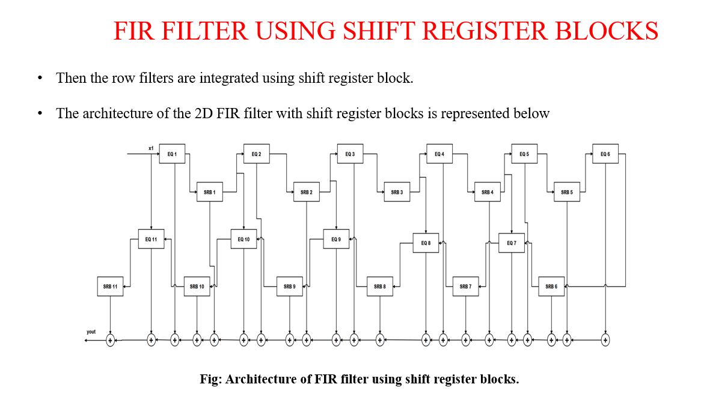
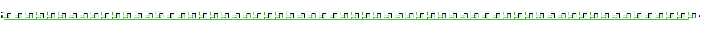
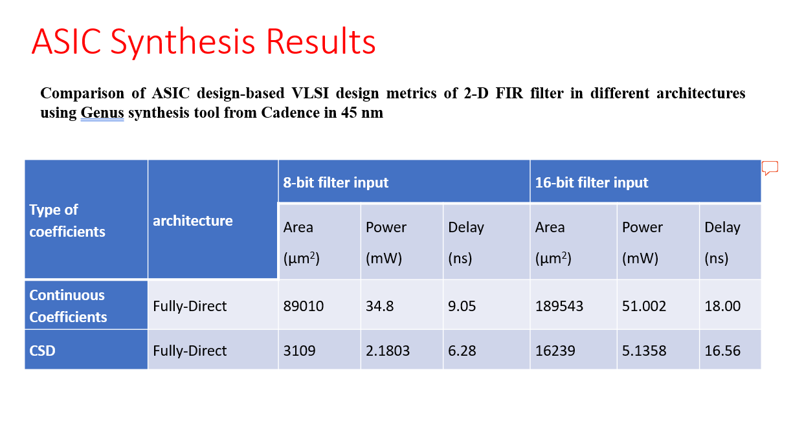
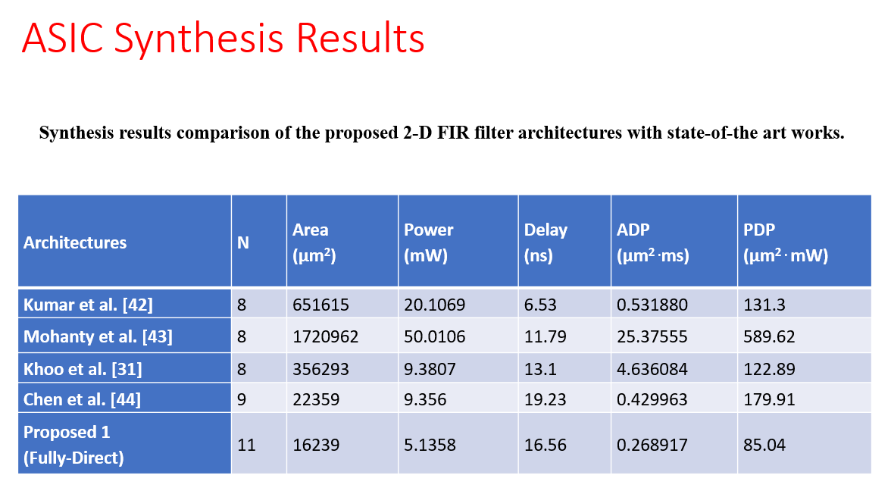

# VLSI Design and Implementation of a 2D FIR Filter Using Canonical Signed Digit (CSD)


---

## Overview

This repository implements a **circularly-symmetric Two-Dimensional (2D) FIR filter** using **Canonical Signed Digit (CSD)** coefficient representation, going from MATLAB-based filter design to a synthesizable Verilog RTL implementation.

Instead of using dedicated hardware multipliers, the filter coefficients are converted to CSD form so that multiplication by each constant coefficient can be realized with **shift and add/subtract operations** in hardware. The repository contains the MATLAB design scripts, the Verilog RTL, testbenches, RTL schematics, FPGA resource-utilization reports, and Cadence Genus (45 nm) ASIC synthesis results.

---

## Project Highlights

- 2D circularly-symmetric FIR filter designed in MATLAB via **McClellan frequency transformation** (`ftrans2`) of a 1D equiripple filter (`firpm`)
- Coefficient-to-CSD conversion using a canonical-signed-digit utility function (`csdigit.m`)
- Multiplierless Verilog RTL datapath — constant multiplication implemented with shift-and-add row-filter modules (`eq1.v`–`eq6.v`)
- 64-word **Shift Register Block (SRB)** used to align delayed rows for 2D convolution
- Fully-direct-form 2D FIR architecture (`EQ1`–`EQ11` / `SRB1`–`SRB11`) as documented in the project's architecture diagram
- RTL functional verification using dedicated Verilog testbenches
- FPGA resource-utilization synthesis reports (per module)
- ASIC synthesis using **Cadence Genus at 45 nm**, including an Area/Power/Delay comparison against a conventional (non-CSD) implementation, and a comparison against prior published architectures

---

## Design Flow

```text
MATLAB (firpm + ftrans2)
        │
        ▼
2D Filter Coefficients
        │
        ▼
CSD Coefficient Conversion (csdigit.m)
        │
        ▼
Verilog RTL (eq1–eq6, srb, final)
        │
        ▼
RTL Functional Simulation (testbenches)
        │
        ▼
FPGA Resource Utilization Reports  +  Cadence Genus ASIC Synthesis (45 nm)
```

---

## System Architecture

The complete filter is built from row-filter modules (`EQ1`–`EQ11`) interleaved with shift-register blocks (`SRB1`–`SRB11`), whose partial outputs are summed to produce `yout`. This mirrors the structure of `RTL/Source_Code/final.v`.

<p align="center">
  
</p>

---

## MATLAB Implementation

### Filter Design

`MATLAB/Code.m` and `MATLAB/MatlabCode.m` design a 1D equiripple linear-phase FIR filter and transform it into a 2D circularly-symmetric filter:

- `remezord` — estimates the required filter order from band edges, magnitudes, and ripple
- `firpm` — designs the 1D equiripple FIR filter
- `freqz` — computes and plots the 1D magnitude response
- `ftrans2` — applies the McClellan transformation to generate the 2D filter from the 1D design
- `freqz2` — computes the 2D frequency response
- `mesh` / `plot` / `contour` — visualize the 2D magnitude response

### CSD Coefficient Generation

`MATLAB/csdigit.m` converts a decimal coefficient into its Canonical Signed Digit representation (adapted from the `csdigit` utility by Patrick J. Moran, AirSprite Technologies Inc., 2006, included with its original license header). This is the representation used to derive the shift-and-add structure implemented in the RTL row-filter modules.

### MATLAB Results

<p align="center">
  
</p>

<p align="center">
  
</p>

> Note: `MATLAB/order_11.png` is the contour plot and `MATLAB/Order_11_contour.png` is the 3D mesh plot — the filenames are swapped relative to their actual content and are reproduced here exactly as they exist in the repository.

`MATLAB/untitled.png` (and corresponding `.fig` files `Order 9.fig`, `Order 11.fig`, `untitled.fig`) contain additional contour-plot runs at other filter orders; the repository does not label which `.fig` corresponds to `untitled.png`, so it is not captioned with a specific order here.

---

## RTL Design

### Verilog Modules

All source files are in `RTL/Source_Code/`:

| File | Role |
|---|---|
| `final.v` | Top-level module — instantiates the `eq1`–`eq6` row filters and `srb` shift-register blocks (as `RF1`–`RF11` / `SRB1`–`SRB11`) and sums their outputs into `yout` |
| `eq1.v` | Row-filter module — 10-stage delay line (`dff`) with shift-and-add CSD multiplication |
| `eq2.v` | Row-filter module — same shift-and-add structure with a different coefficient set |
| `eq3.v` | Row-filter module — same shift-and-add structure with a different coefficient set |
| `eq4.v` | Row-filter module — same shift-and-add structure with a different coefficient set |
| `eq5.v` | Row-filter module — same shift-and-add structure with a different coefficient set |
| `eq6.v` | Row-filter module — same shift-and-add structure with a different coefficient set |
| `srb.v` | Shift Register Block — 64-stage chain of `dff` instances |
| `dff.v` | D flip-flop with reset, used throughout as the delay element |
| `dff1.v` | A second D flip-flop module identical to `dff.v`; present in the source tree but not instantiated by any other module |

### Row-Filter Shift-and-Add Architecture

Each `eqN.v` module implements constant multiplication as a chain of right-shift and add operations on delayed samples, matching the CSD coefficients from the MATLAB design. `eq1.v`, for example, corresponds to the following diagram:

<p align="center">
  
</p>

Corresponding diagrams for the other coefficient sets (`Eq 2.png`–`Eq 6.png`) are available in `Architecture/`.

### Shift Register Block (SRB)

`srb.v` is a 64-stage register chain used to buffer a full row of samples, so that vertically-neighboring rows are available together for the 2D convolution.

<p align="center">
  
</p>

### RTL Verification

The design is exercised by four testbenches in `RTL/Testbench/`:

| Testbench | Target | Description |
|---|---|---|
| `tb_major.v` | `final` | Generates clock/reset and applies a sequence of directed input values to the top-level filter |
| `tb_pro.v` | `final` | Generates clock/reset and applies a longer directed input sequence to the top-level filter |
| `tb_srb.v` | `srb` | Applies a static input to the shift register block |
| `tb_srb123.v` | `srb` | Applies a short directed sequence to the shift register block |

These are directed-stimulus testbenches (clock generation, reset sequence, and a fixed sequence of input values) intended for waveform-based functional simulation; they do not contain self-checking assertions. The repository does not include simulation waveform or log-file screenshots, so no simulation-tool name or pass/fail result is stated here.

### RTL Schematics

<p align="center">
  
</p>

Per-module tool-generated schematics (`RowFilter1.pdf`–`RowFilter6.pdf`) are available in `RTL/RTL_Schematics/`.

---

## Synthesis and Results

### FPGA Resource Utilization

Per-module synthesis utilization reports (Xilinx 7-series primitives — `FDCE`, `SRL16E`, `CARRY4`, `MMCME2_ADV`, `IDELAYE2`, etc.) are provided as report screenshots. The figures below are read directly from those reports:

| Module | Slice LUTs | Slice Registers | Notes |
|---|---:|---:|---|
| `final` (top level) | 95 | 137 | Also reports 154 Bonded IOBs (of 200) and 1 `BUFG`; primitive breakdown includes 144 `OBUF`, 117 `FDCE`, 51 `LUT2`, 27 `CARRY4`, 24 `SRLC32E` |
| `srb` | 20 | 79 | — |
| `eq1` | 22 | 35 | Cell usage: 27 `FDCE`, 18 `LUT2`, 10 `IBUF`, 8 `SRL16E`, 8 `OBUF`, 8 `FDRE`, 2 `CARRY4`, 1 `BUFG` |

Source screenshots: `Results/final 1.1.png`, `final 1.2.png`, `final 1.3.png`, `final 1.4png.png`, `Results/srb1.1.png`, `srb1.2.png`, `Results/Equations/eq1.1.png`, `eq1.2.png`. Corresponding per-module reports for `eq2`–`eq6` (`eq2.1.png`/`eq2.2.png` … `eq6.1.png`/`eq6.2.png`) are also available in `Results/Equations/`.

A separate design-elaboration summary (`Results/final output.png`) reports an adder breakdown (2-, 3-, 11-, 16-, 17-, 18-, and 23-input adders) and a total of 814 8-bit registers for the elaborated design.

### ASIC Synthesis (Cadence Genus, 45 nm)

`Synthesis/Reports/ADP_Report.png` reports Area/Power/Delay for the Fully-Direct architecture, comparing continuous (non-CSD) coefficients against CSD coefficients, for both 8-bit and 16-bit filter input:

<p align="center">
  
</p>

| Coefficient Type | Architecture | Input Width | Area (µm²) | Power (mW) | Delay (ns) |
|---|---|---:|---:|---:|---:|
| Continuous Coefficients | Fully-Direct | 8-bit | 89010 | 34.8 | 9.05 |
| Continuous Coefficients | Fully-Direct | 16-bit | 189543 | 51.002 | 18.00 |
| CSD | Fully-Direct | 8-bit | 3109 | 2.1803 | 6.28 |
| CSD | Fully-Direct | 16-bit | 16239 | 5.1358 | 16.56 |

### Comparison with Prior Work

`Synthesis/Reports/ASIC_result_comp.png` compares the CSD Fully-Direct architecture (`N = 11`) against prior published 2D FIR filter architectures, as documented in the project report:

<p align="center">
  
</p>

| Architecture | N | Area (µm²) | Power (mW) | Delay (ns) | ADP (µm²·ms) | PDP (µm²·mW) |
|---|---:|---:|---:|---:|---:|---:|
| Kumar et al. | 8 | 651615 | 20.1069 | 6.53 | 0.531880 | 131.3 |
| Mohanty et al. | 8 | 1720962 | 50.0106 | 11.79 | 25.37555 | 589.62 |
| Khoo et al. | 8 | 356293 | 9.3807 | 13.1 | 4.636084 | 122.89 |
| Chen et al. | 9 | 22359 | 9.356 | 19.23 | 0.429963 | 179.91 |
| **Proposed (Fully-Direct)** | **11** | **16239** | **5.1358** | **16.56** | **0.268917** | **85.04** |

The full list of cited works corresponding to `[42]`, `[43]`, `[31]`, `[44]` is in the project report under `Documentation/Report/`.

---

## Repository Structure

```text
2D-FIR-Filter-Design-Using-CSD/
│
├── Architecture/
│   ├── All Architectures Word.docx
│   └── Eq 1.png ... Eq 6.png
│
├── Documentation/
│   ├── Papers/
│   │   └── Major Report-modfied.docx
│   ├── Presentation/
│   │   └── modified-Major_Project_Final_Review PPT.pptx
│   └── Report/
│       └── Major Report-modfied.docx
│
├── MATLAB/
│   ├── Code.m
│   ├── MatlabCode.m
│   ├── csdigit.m
│   ├── Order 9.fig
│   ├── Order 11.fig
│   ├── Order_11_contour.png
│   ├── order_11.png
│   ├── untitled.fig
│   └── untitled.png
│
├── References/
│   ├── 2. OVK-MSSP.pdf
│   ├── Bindima, T., & Elias, E. (2019). Low-complexity 2-D digital FIR filters using polyphase decomposition and....pdf
│   ├── IJRTEPAPER-OVK.pdf
│   └── memory-optimization-in-adaptive-fir-filter-using-apc-oms-and-cse-method-IJERTCONV3IS16113.pdf
│
├── Results/
│   ├── Equations/
│   │   └── eq1.1.png, eq1.2.png ... eq6.1.png, eq6.2.png
│   ├── Final Filter.pdf
│   ├── Final Filter 1.png
│   ├── Final Filter.png
│   ├── Shift_Register_Block.png
│   ├── Shift_register_block_arch.png
│   ├── final 1.1.png, final 1.2.png, final 1.3.png, final 1.4png.png
│   ├── final filter elob.png
│   ├── final output.png
│   └── srb1.1.png, srb1.2.png
│
├── RTL/
│   ├── RTL_Schematics/
│   │   ├── RowFilter1.pdf ... RowFilter6.pdf
│   │   └── SRB.png
│   ├── Source_Code/
│   │   ├── dff.v
│   │   ├── dff1.v
│   │   ├── eq1.v ... eq6.v
│   │   ├── final.v
│   │   └── srb.v
│   └── Testbench/
│       ├── tb_major.v
│       ├── tb_pro.v
│       ├── tb_srb.v
│       └── tb_srb123.v
│
├── Synthesis/
│   └── Reports/
│       ├── ADP_Report.png
│       └── ASIC_result_comp.png
│
├── LICENSE
└── README.md
```

---

## Tools and Technologies

| Category | Tool |
|---|---|
| Filter design / algorithm development | MATLAB (Signal Processing Toolbox: `firpm`, `remezord`, `ftrans2`, `freqz2`) |
| RTL design | Verilog HDL |
| FPGA synthesis / resource reporting | Xilinx synthesis tool (7-series primitives) |
| ASIC synthesis | Cadence Genus, 45 nm |
| Documentation | Microsoft Word, Microsoft PowerPoint |

---

## Applications

2D FIR filters of this type are generally used in image and video processing (e.g. smoothing/low-pass filtering of image data). The repository does not include a specific application demo or dataset beyond the filter design and its hardware implementation.

---

## Future Work

The repository's synthesis results are limited to the Fully-Direct CSD architecture described above. Beyond that, no future-work roadmap is documented in the repository.

---

## How to Use

### MATLAB

1. Open `MATLAB/Code.m` (or `MATLAB/MatlabCode.m`) in MATLAB.
2. Run the script and supply the requested inputs at the prompts: band edges, desired magnitudes, desired ripple, and sampling frequency.
3. The script prints the 1D FIR filter coefficients and plots the 1D magnitude response, then generates the 2D filter via `ftrans2` and plots its 2D response (`mesh`/`plot`/`contour`, depending on which lines are active in the script).
4. `MATLAB/csdigit.m` can be called separately, e.g. `csdigit(num, range, resolution)`, to obtain the CSD representation of a coefficient.

### Verilog RTL

1. The RTL sources are in `RTL/Source_Code/` and the testbenches in `RTL/Testbench/`.
2. `tb_major.v` and `tb_pro.v` instantiate the top-level `final` module; `tb_srb.v` and `tb_srb123.v` instantiate `srb` standalone.
3. Compile and simulate the desired testbench together with the RTL sources it depends on, using a Verilog simulator of your choice.

---

## References

The following reference material is included in `References/` and `Documentation/Report/`:

- `References/2. OVK-MSSP.pdf`
- `References/Bindima, T., & Elias, E. (2019). Low-complexity 2-D digital FIR filters using polyphase decomposition and....pdf`
- `References/IJRTEPAPER-OVK.pdf`
- `References/memory-optimization-in-adaptive-fir-filter-using-apc-oms-and-cse-method-IJERTCONV3IS16113.pdf`
- `Documentation/Report/Major Report-modfied.docx` (full project report, including the literature comparison cited above)

`MATLAB/csdigit.m` is adapted from the `csdigit` utility originally written by Patrick J. Moran, AirSprite Technologies Inc. (2006); its original license header is preserved in the file.

---

## Author

**Manchikanti Surya Vardhan**

B.Tech — Electronics and Communication Engineering (ECE)
CVR College of Engineering, Hyderabad

GitHub: [github.com/msuryavardhan](https://github.com/msuryavardhan)

---

## License

This project is licensed under the MIT License — see [`LICENSE`](LICENSE) for details.
