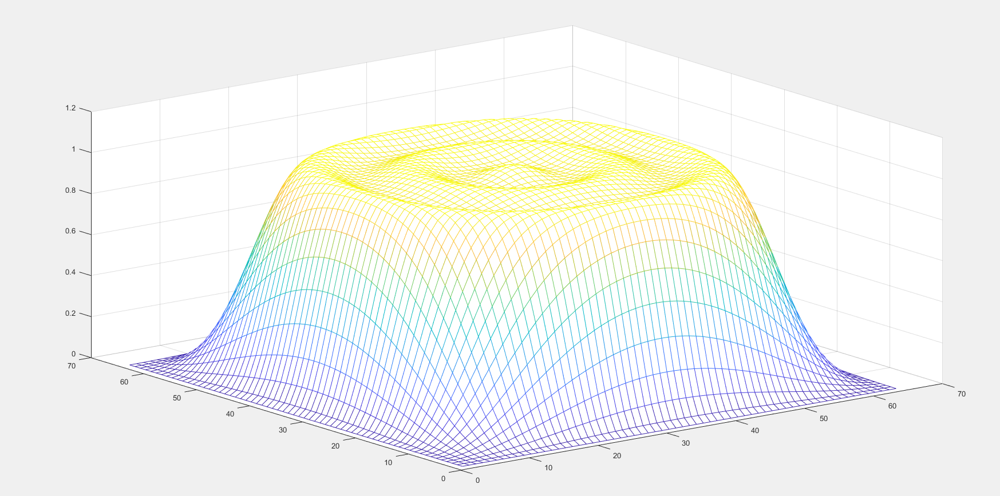
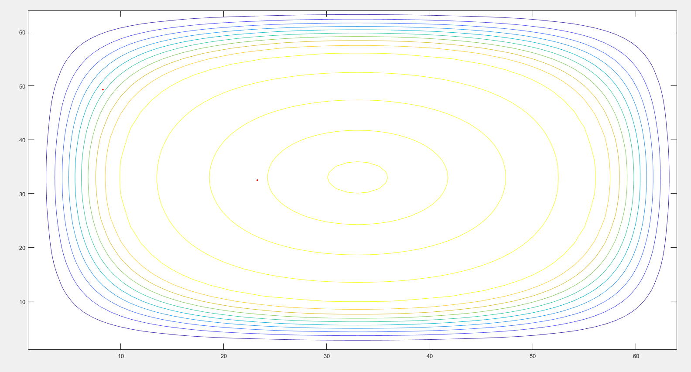

# VLSI Design and Implementation of Two-Dimensional FIR Filter Architectures Using Canonical Signed Digit (CSD)


---

# Project Overview

This project presents the **design, optimization, RTL implementation, and ASIC synthesis** of a **Two-Dimensional Finite Impulse Response (2D FIR) Filter** using **Canonical Signed Digit (CSD)** representation for multiplier optimization.

The primary objective of this work is to reduce the hardware complexity associated with conventional multiplier-based FIR filters by replacing multipliers with **shift-and-add operations** using CSD coefficients. This significantly improves hardware efficiency by reducing:

- Silicon Area
- Power Consumption
- Critical Path Delay
- Hardware Complexity

The project combines **Digital Signal Processing (DSP)** algorithms with **RTL Design** and **ASIC Synthesis**, making it suitable for VLSI and FPGA implementations.

---

# Project Highlights

✔ MATLAB based 2D FIR Filter Design

✔ McClellan Transform based Filter Generation

✔ Canonical Signed Digit (CSD) Coefficient Optimization

✔ Hierarchical Verilog RTL Design

✔ Shift Register Based Architecture

✔ Fully Direct Form 2D FIR Architecture

✔ RTL Simulation

✔ RTL Schematics

✔ Cadence Genus ASIC Synthesis

✔ Area, Power and Timing Analysis

✔ Performance Comparison with Conventional Architecture

---

# Motivation

Two-Dimensional FIR filters are widely used in image processing applications such as:

- Image Enhancement
- Image Restoration
- Image Sharpening
- Medical Imaging
- Pattern Recognition
- Video Processing
- Computer Vision
- Satellite Image Processing

Although FIR filters provide excellent linear phase characteristics and guaranteed stability, they require a large number of multipliers, resulting in increased silicon area, power consumption, and hardware complexity.

To address these challenges, this project employs the **Canonical Signed Digit (CSD)** representation, which minimizes the number of non-zero digits in filter coefficients. This enables multiplication to be implemented using only **shift and add operations**, significantly reducing hardware resource utilization.

---

# Key Features

- Design of a Circularly Symmetric 2D FIR Filter
- MATLAB-Based Coefficient Generation
- McClellan Transform Implementation
- Canonical Signed Digit (CSD) Optimization
- Multiplierless FIR Architecture
- Verilog HDL RTL Design
- Modular Hardware Architecture
- Shift Register Based Implementation
- ASIC Synthesis using Cadence Genus
- Performance Evaluation using Area, Power and Delay Metrics

---

# Design Flow

```text
                    MATLAB

                       │

                       ▼

          Filter Coefficient Generation

                       │

                       ▼

         Canonical Signed Digit (CSD)

                       │

                       ▼

          Verilog RTL Implementation

                       │

                       ▼

               RTL Simulation

                       │

                       ▼

         Cadence Genus Synthesis

                       │

                       ▼

      Area • Power • Timing Analysis

                       │

                       ▼

        Hardware Performance Evaluation
```

---

# System Architecture

The overall implementation flow of the proposed architecture is shown below.

> **(Insert Architecture Diagram Here)**

```
Images/Architecture.png
```

The proposed architecture consists of the following stages:

1. MATLAB-based filter coefficient generation
2. CSD coefficient conversion
3. Row Filter implementation
4. Shift Register Block (SRB)
5. Fully Direct Form 2D FIR Architecture
6. RTL Verification
7. ASIC Synthesis

---

# Repository Structure

```
VLSI-2D-FIR-Filter-Using-CSD
│
├── MATLAB
│   ├── Filter_Design
│   ├── CSD_Generation
│   ├── Coefficients
│   ├── Scripts
│   └── Results
│
├── RTL
│   ├── Source_Code
│   ├── Testbench
│   └── RTL_Schematics
│
├── Synthesis
│   └── Cadence_Genus
│       ├── Reports
│       ├── Netlist
│       └── Scripts
│
├── Results
│   ├── ASIC_Results
│   ├── Performance_Comparison
│   ├── Resource_Utilization
│   └── Images
│
├── Documentation
│   ├── Report
│   ├── Presentation
│   └── Papers
│
├── Architecture
│
├── Images
│
└── References
```

---

# Tools and Software

| Category | Tool |
|-----------|------|
| Programming Language | Verilog HDL |
| Algorithm Development | MATLAB |
| RTL Simulation | Cadence NC Launch / NC Simulator |
| Logic Synthesis | Cadence Genus |
| Documentation | Microsoft Word |
| Presentation | Microsoft PowerPoint |

---

# MATLAB Implementation

The design process begins with MATLAB, where the filter coefficients are generated and optimized before hardware implementation.

The MATLAB workflow includes:

- Filter Specification
- McClellan Transformation
- Circular Symmetry Generation
- Filter Coefficient Calculation
- Canonical Signed Digit (CSD) Conversion
- Frequency Response Analysis
- Contour Plot Generation

---

## MATLAB Outputs

The following outputs are generated during MATLAB implementation:

- Low Pass Filter Frequency Response
- Contour Plot
- Filter Coefficients
- CSD Coefficients
- Order-9 Filter Results
- Order-11 Filter Results
- Band Edge Analysis

### Order-11 Contour Plot



### Order-11 Filter Response



---

# Canonical Signed Digit (CSD)

Canonical Signed Digit (CSD) representation is an optimized number representation technique used to minimize the number of non-zero digits in constant coefficients.

Unlike conventional binary multiplication, CSD enables multiplication using only:

- Shift Operations
- Addition
- Subtraction

This eliminates the need for dedicated hardware multipliers, leading to significant reductions in silicon area and power consumption.

### Advantages of CSD

- Reduced Hardware Complexity
- Lower Area
- Lower Power Consumption
- Reduced Switching Activity
- Faster Arithmetic Operations
- Efficient ASIC Implementation

---
---

# RTL Design Methodology

After generating the optimized CSD coefficients in MATLAB, the hardware architecture was implemented using **Verilog HDL**. The design follows a modular and hierarchical approach, making the implementation easier to understand, verify, and extend.

The RTL design converts the mathematical representation of the 2D FIR filter into synthesizable digital hardware. Each functional block performs a dedicated task, and all modules are integrated to realize the complete filter architecture.

The modular implementation improves readability, simplifies debugging, and enables future enhancements such as FPGA deployment or ASIC synthesis.

---

# Hardware Architecture

The proposed architecture consists of several interconnected hardware modules.

The major building blocks include:

- Input Data Interface
- Row Filter Modules
- Shift Register Block (SRB)
- Delay Elements
- CSD Arithmetic Blocks
- Output Accumulation Logic

The complete architecture processes the incoming image samples by applying optimized CSD coefficients to perform two-dimensional convolution.


### Architecture


```


# RTL Design Flow

```
Input Pixels
      │
      ▼
Row Filter
      │
      ▼
Shift Register Block
      │
      ▼
Column Processing
      │
      ▼
CSD Arithmetic
      │
      ▼
Output Accumulator
      │
      ▼
Filtered Image
```

---

# Verilog RTL Modules

The design is divided into multiple Verilog modules to improve modularity and code reuse.

## Main Modules

| Module | Description |
|---------|-------------|
| final.v | Top-level module integrating the complete 2D FIR filter |
| eq1.v | Arithmetic processing block |
| eq2.v | Arithmetic processing block |
| eq3.v | Arithmetic processing block |
| eq4.v | Arithmetic processing block |
| eq5.v | Arithmetic processing block |
| eq6.v | Arithmetic processing block |
| srb.v | Shift Register Block for storing intermediate samples |
| dff.v | D Flip-Flop used for delay implementation |

Each module performs a dedicated function within the overall filtering architecture.

---

# Shift Register Block (SRB)

The Shift Register Block is responsible for storing previous input samples so that neighboring pixels are simultaneously available during convolution.

The SRB enables continuous streaming of image data without repeatedly accessing external memory.

### Advantages

- Efficient data buffering
- Continuous pixel flow
- Reduced memory access
- Suitable for pipelined architectures

> **Insert Shift Register Diagram Here**

```
Images/Shift_Register.png
```

---

# CSD Arithmetic Implementation

Instead of conventional multipliers, the proposed design utilizes **Canonical Signed Digit (CSD)** coefficients.

Multiplication by constant coefficients is realized using:

- Left Shift Operations
- Right Shift Operations
- Addition
- Subtraction

This approach significantly reduces hardware complexity compared to conventional multiplier-based implementations.

---

# Hierarchical RTL Design

The hardware implementation follows a hierarchical design methodology.

```
Top Module (final.v)

│

├── eq1

├── eq2

├── eq3

├── eq4

├── eq5

├── eq6

├── srb

└── dff
```

The hierarchy improves maintainability, debugging, and scalability of the RTL implementation.

---

# RTL Verification

The functionality of the RTL modules was verified through simulation by applying representative input vectors and observing the generated outputs.

The verification process ensured:

- Correct functional behavior
- Proper data flow between modules
- Correct operation of delay elements
- Accurate implementation of the filter architecture

---

# RTL Schematics

RTL schematic generation provides a graphical representation of the synthesized hardware structure derived from the Verilog source code.

The schematics help visualize:

- Module hierarchy
- Data flow
- Arithmetic blocks
- Registers
- Interconnections

> **Insert RTL Schematic Here**

```
Images/RTL_Schematic.png
```

---

# Design Advantages

The proposed implementation offers several advantages over conventional multiplier-based FIR filter architectures.

- Reduced arithmetic complexity
- Efficient hardware implementation
- Modular RTL architecture
- Improved scalability
- Lower computational complexity
- Optimized constant multiplication using CSD
- Suitable for FPGA and ASIC implementation

---

# Applications

The proposed 2D FIR filter architecture can be used in several Digital Signal Processing and Image Processing applications.

- Image Enhancement
- Image Restoration
- Medical Imaging
- Video Processing
- Object Detection Pre-processing
- Pattern Recognition
- Remote Sensing
- Satellite Imaging
- Edge Enhancement
- Noise Reduction

---

# Project Learning Outcomes

This project provided practical experience in several VLSI and Digital Design concepts.

- Digital Signal Processing Fundamentals
- Two-Dimensional FIR Filter Design
- Canonical Signed Digit Representation
- MATLAB Algorithm Development
- RTL Design using Verilog HDL
- Hierarchical Hardware Design
- Modular Digital Design Methodology
- Hardware-Oriented Optimization Techniques
- Technical Documentation

---

# Source Code Organization

```
RTL/

├── final.v

├── eq1.v

├── eq2.v

├── eq3.v

├── eq4.v

├── eq5.v

├── eq6.v

├── srb.v

└── dff.v
```

---
---

# Project Results

The implementation demonstrates the feasibility of designing a Two-Dimensional FIR filter using Canonical Signed Digit (CSD) representation. The combination of MATLAB-based coefficient generation and modular Verilog RTL implementation provides an efficient framework for hardware realization.

The project successfully demonstrates:

- MATLAB-based 2D FIR filter design
- McClellan Transform for coefficient generation
- Canonical Signed Digit (CSD) optimization
- Hierarchical Verilog RTL implementation
- Modular hardware architecture
- RTL verification
- Hardware-oriented filter implementation methodology

---

# MATLAB Results

MATLAB was used to verify the filter characteristics before hardware implementation.

The generated outputs include:

- Frequency Response
- Magnitude Response
- Contour Plots
- Filter Coefficients
- Optimized CSD Coefficients

> **Insert MATLAB Frequency Response**

```
Images/Frequency_Response.png
```

> **Insert MATLAB Contour Plot**

```
Images/Contour_Plot.png
```

---

# Repository Contents

| Folder | Description |
|---------|-------------|
| MATLAB | MATLAB source files and filter design scripts |
| RTL | Verilog HDL source code |
| Documentation | Final report, presentation, and supporting documents |
| Architecture | System architecture and block diagrams |
| Images | Figures used in the README |
| Results | MATLAB outputs and project results |
| References | Research papers and reference material |

---

# Skills Demonstrated

This project helped strengthen practical knowledge in the following areas:

### Digital Signal Processing
- FIR Filter Design
- 2D Digital Filtering
- McClellan Transformation
- Frequency Response Analysis

### RTL Design
- Verilog HDL
- Modular Design
- Hierarchical Architecture
- Shift Register Design
- Digital Arithmetic

### VLSI Design
- Hardware-Oriented Optimization
- Canonical Signed Digit (CSD)
- Efficient Constant Multiplication
- Digital Hardware Design Methodology

### Software Tools
- MATLAB
- Verilog HDL
- Microsoft Word
- Microsoft PowerPoint

---

# Future Enhancements

The current repository focuses on the algorithm development and RTL implementation of the proposed architecture.

Possible future enhancements include:

- FPGA implementation and hardware validation
- ASIC synthesis using industry-standard EDA tools
- Static Timing Analysis (STA)
- Physical Design implementation
- Power optimization techniques
- Pipelined architecture
- Support for higher-order filters
- Integration with image-processing pipelines

---

# How to Use

## MATLAB

1. Open the MATLAB folder.
2. Execute the filter design scripts.
3. Generate filter coefficients.
4. Observe the frequency response and contour plots.

## Verilog RTL

1. Open the RTL folder.
2. Review the Verilog modules.
3. Compile the design using your preferred Verilog simulator.
4. Simulate the top-level module and verify functionality.

---

# References

1. R. E. Crochiere and L. R. Rabiner, *Multirate Digital Signal Processing*.
2. Sanjit K. Mitra, *Digital Signal Processing: A Computer-Based Approach*.
3. John G. Proakis and Dimitris G. Manolakis, *Digital Signal Processing: Principles, Algorithms, and Applications*.
4. Research papers on Canonical Signed Digit (CSD) arithmetic and multiplierless FIR filter architectures.
5. MATLAB documentation for digital filter design.

---

# Author

**Manchikanti Surya Vardhan**

B.Tech – Electronics and Communication (ECE) 
CVR College of Engineering, Hyderabad

**Areas of Interest**

- RTL Design
- ASIC Design
- Physical Design
- Digital VLSI
- FPGA Design
- Digital Signal Processing

GitHub: **https://github.com/msuryavardhan**

---

# License

This project is intended for educational and research purposes.

You are welcome to use the source code and documentation with appropriate attribution.

---

# Acknowledgements

I would like to thank my faculty members, mentors, and project teammates for their guidance and support during the development of this academic project.

---

## If you find this repository useful

⭐ Star this repository

🍴 Fork it

📚 Use it for learning and academic purposes

---

> *"Good hardware design is not just about making it work—it's about making it efficient, scalable, and elegant."*
